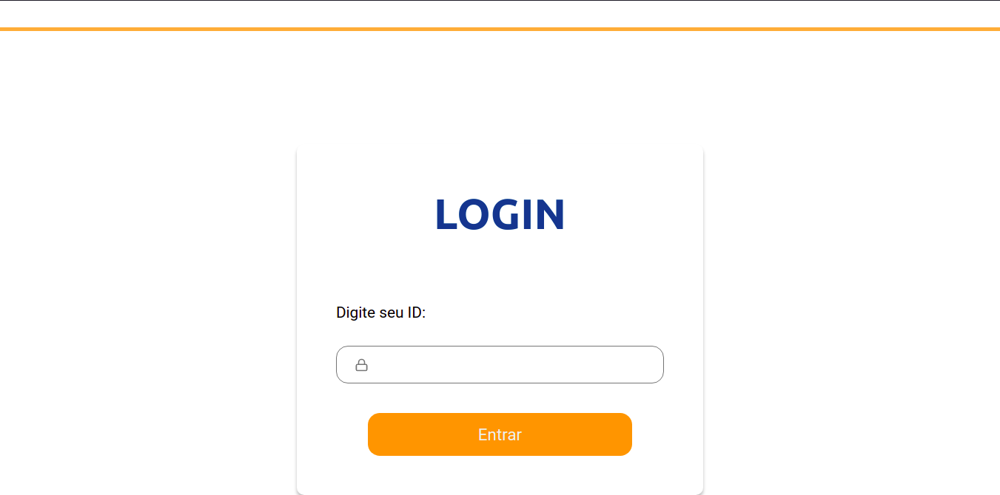
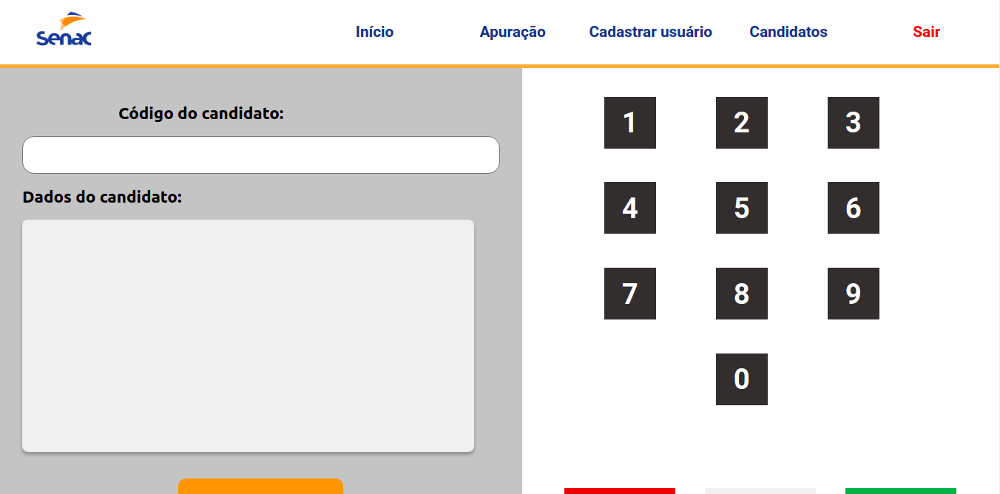
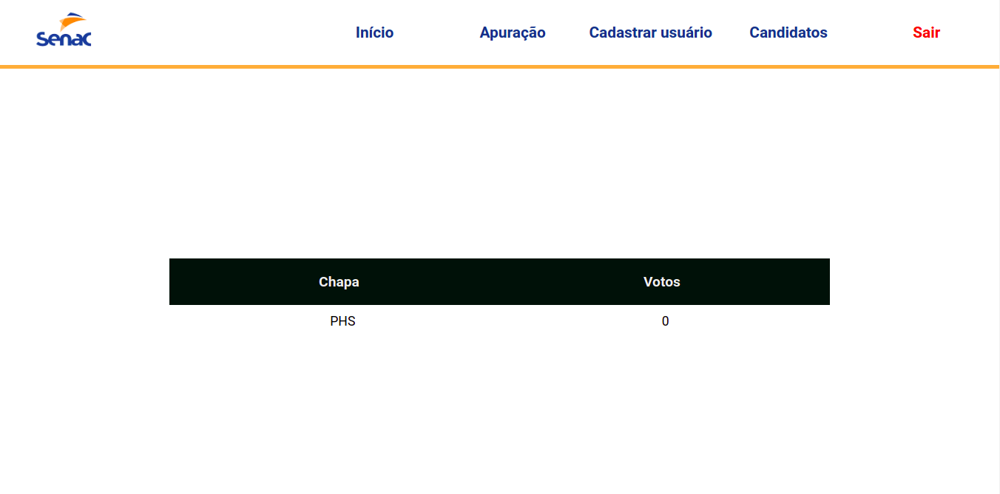
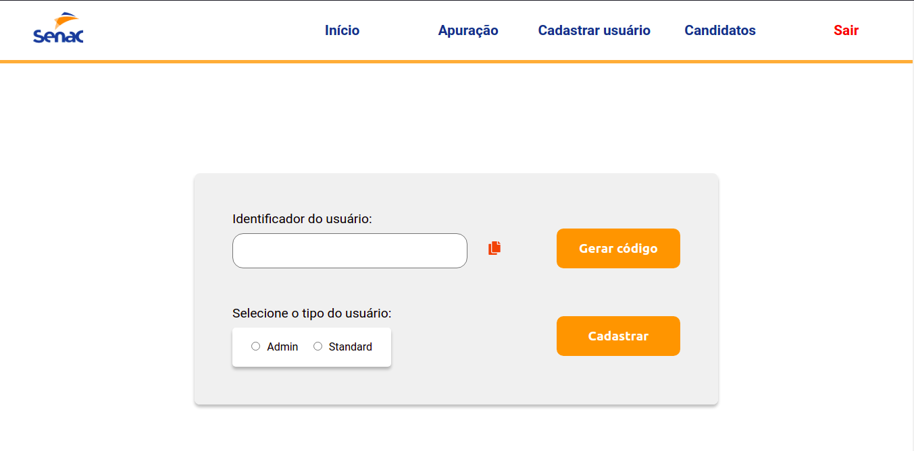
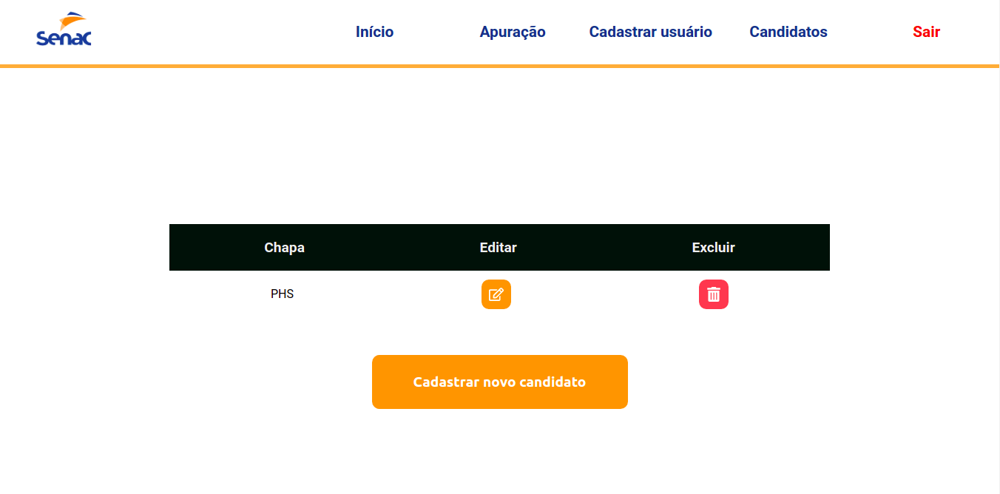
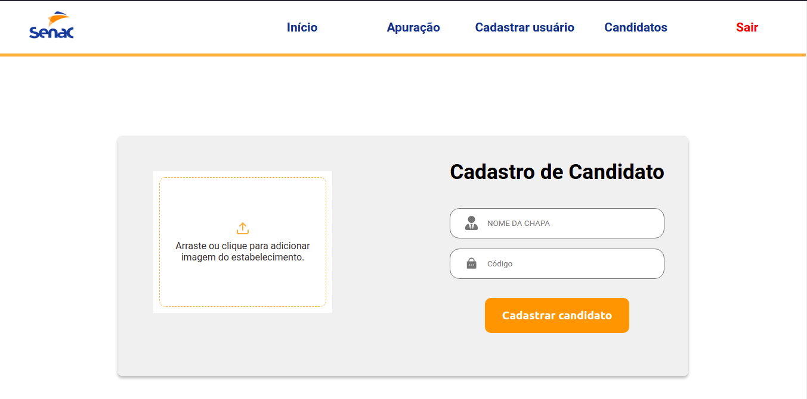

# Aplicação Urna Eletrônica Web

## páginas e funcionalidades

<h3>
- Login: A página principal é a página de login, onde somente é possível realizar a autenticação com o código de acesso do usuário, baseado em suas regras de acesso.

OBS: Caso o usuário for <strong>standard</strong> e já tiver efetuado seu voto ele não poderá se autenticar novamente no app, porém, caso o candidado for <strong>admin</strong> não poderá mais efetivar voto mas continuará tendo acesso normalmente as outras funcionalidades.
</h3>

<h3>
- Voto: É possível consultar o candidato que irá receber o voto e efetivar o voto.

OBS: Caso o usuário seja do tipo <strong>standard</strong> após efetivar o voto será deslogado do sistema, não sendo possível se authenticar novamente como mencionado acima.
</h3>

<h3>
- Apuração: Será exibido a quantidade de votos que cada candidato recebeu sua respectiva chapa.
</h3>

<h3>
- Cadastro de usuário: É possível realizar cadastro de novos usuários, copiar código de usuário gerado no campo <strong>identificador de usuário</strong> e escolher qual tipo de usuário será cadastrado.
</h3>

<h3>
- Lista de candidatos: Será exibido os candidatos já cadastrados previamente sendo possível editar seus dados cadastrais como: foto, nome da chapa e código, e também de exclui-lo. Também é possível navegar para a página de cadastro de um novo candidato.
</h3>

<h3>
- Cadastro de candidato: É possível cadastrar um novo candidato informando sua chapa, código e foto.
</h3>

